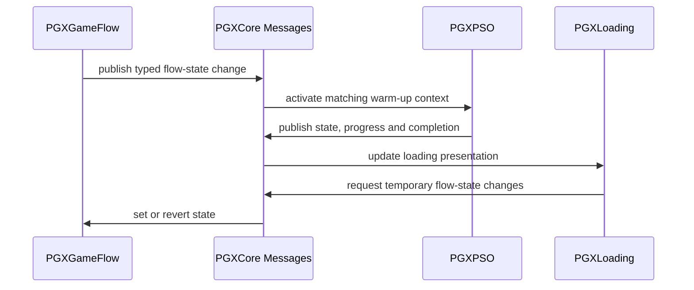

# Runtime Flows

## Configuration and discovery

Projects author settings, PGX configuration Data Assets and system profiles.
Runtime subsystems resolve those inputs, while Core registry interfaces allow
tagged assets and capabilities to be discovered without a sibling plugin
dependency.

## Game Flow, PSO and Loading

These systems coordinate through Core messages rather than direct runtime module
dependencies.

This flow keeps each runtime plugin dependent on Core rather than on the other
feature plugins.

## Save lifecycle

Core defines shared saveable contracts and bridge payloads. `PGXSave` owns slot
operations, providers, serialization, backup, versioning, migrations and async
actions. `PGXSaveNodes` contains the save-specific Blueprint graph node and is
classified `UncookedOnly`.

## Audio

`PGXAudio` resolves authored channel/configuration assets and delegates playback
to a backend. The current code contains both legacy and Audio Modulation backend
paths; documentation should not describe the system as exclusively tied to one
backend.

## Memory and GC observation

`PGXMGOS` observes garbage-collection behavior, snapshots and class health. It
reports incidents and diagnostics through its own subsystem and Core
observability contracts. It has no direct runtime dependency on Audio or the
other feature systems.

## Editor inspection

Feature editor modules expose focused inspectors. `PGXEditorTools` composes the
selected inspectors into an editor hub, while `PGXDocs`, `PGXScaffold`,
`PGXTutorials` and `PGXVersionControl` retain separate workflows.
