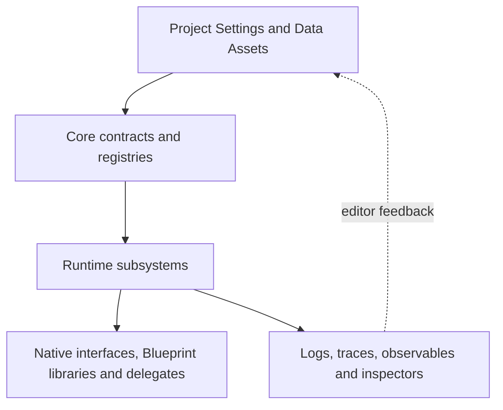

# System Map

## Plugin dependencies

```mermaid
graph TD
  Core[PGXCore]
  Ability[PGXAbility] --> Core
  AI[PGXAI] --> Core
  Audio[PGXAudio] --> Core
  Camera[PGXCamera] --> Core
  Colony[PGXColony] --> Core
  Crafting[PGXCrafting] --> Core
  Environment[PGXEnvironment] --> Core
  GameFlow[PGXGameFlow] --> Core
  Input[PGXInput] --> Core
  Interaction[PGXInteraction] --> Core
  Inventory[PGXInventory] --> Core
  Loading[PGXLoading] --> Core
  MGOS[PGXMGOS] --> Core
  PSO[PGXPSO] --> Core
  Save[PGXSave] --> Core
  Spawn[PGXSpawn] --> Core
  Trade[PGXTrade] --> Core
  UI[PGXUI] --> Core
  Vehicles[PGXVehicles] --> Core
  Docs[PGXDocs] --> Core
  Scaffold[PGXScaffold] --> Core
  Tutorials[PGXTutorials] --> Core
  VersionControl[PGXVersionControl] --> Core
  EditorTools[PGXEditorTools] --> Core
  EditorTools --> Audio
  EditorTools --> GameFlow
  EditorTools --> Loading
  EditorTools --> MGOS
  EditorTools --> PSO
  EditorTools --> Save
  EditorTools --> VersionControl
  Harness[PGXSimHarness] --> Core
  Harness --> EditorTools
  Harness --> Docs
  Harness --> GameFlow
  Harness --> Save
  Harness --> PSO
  Harness --> Loading
  Harness --> MGOS
  Harness --> Audio
  Harness --> Spawn
  Harness --> AI
  Harness --> Ability
```

The arrows represent declared plugin dependencies. `PGXEditorTools` aggregates
editor inspectors, and `PGXSimHarness` composes selected systems for editor-side
verification. Neither is part of packaged runtime execution.

## Core capabilities

`PGXCore` provides contracts shared by the included plugins:

- configuration assets, profiles and project settings;
- tagged data registry and discovery interfaces;
- typed message channels and bridge payloads;
- Gameplay Tag-to-handler resolution with configurable lifecycles;
- logging, trace, observability and validation primitives;
- shared Blueprint and editor extension points.

Messages and event handlers are separate mechanisms. Messages distribute typed
payloads over tag-addressed channels. Event handlers resolve a tag to a handler
class and manage its lifecycle.

## Product layers

The dashed arrow marks a manual editor workflow: inspection and validation help
authors correct configuration, but do not rewrite runtime policy.

## Boundaries

- A plugin descriptor defines plugin-level requirements.
- A `Build.cs` file defines compile-time module dependencies.
- Gameplay Tags and typed payloads define cross-system message contracts.
- Data Assets define authored policy that can be reviewed and versioned.
- Editor modules may inspect runtime state, but runtime modules should not rely
  on editor UI.

See [Runtime flows](runtime-flows.md) for concrete coordination paths.
